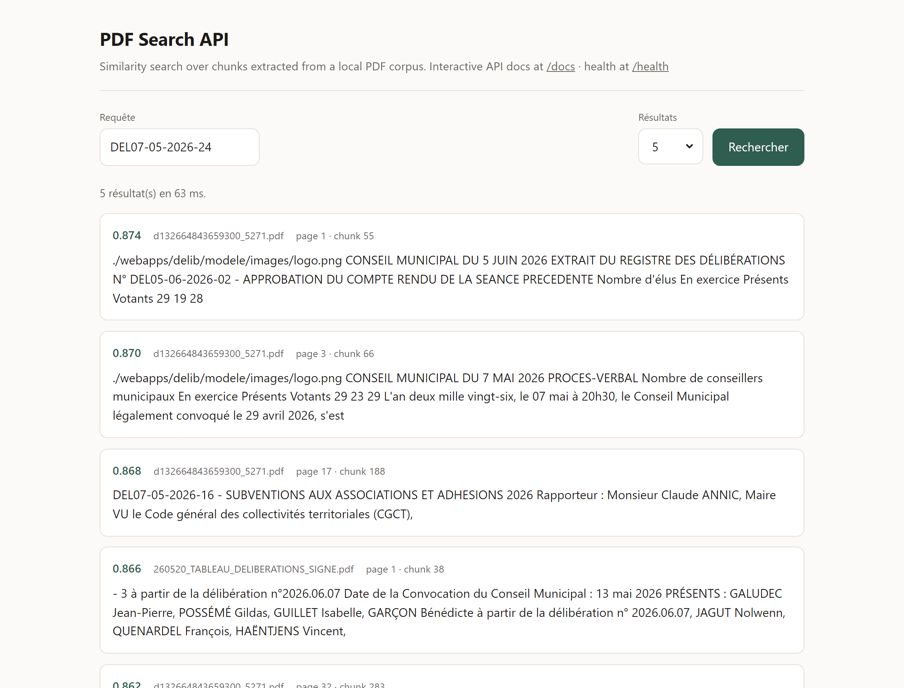
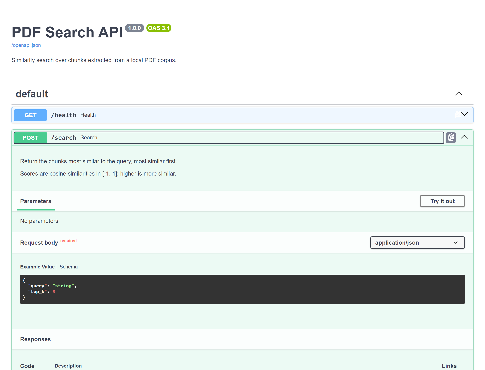
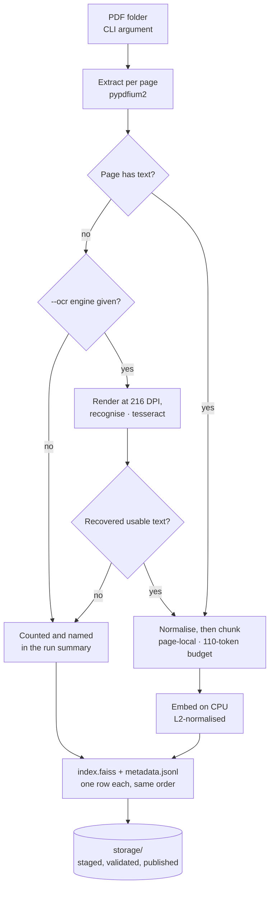
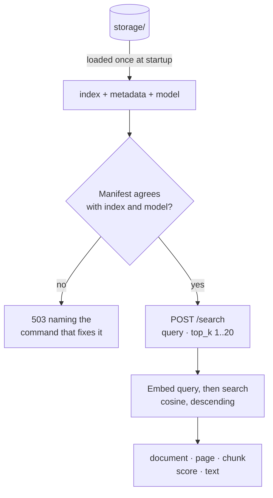
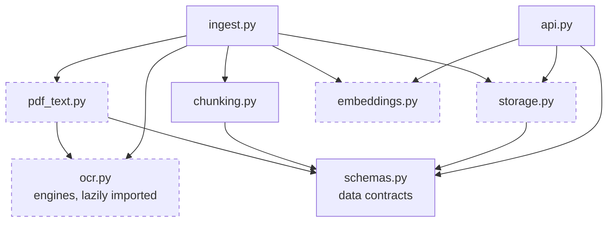

# PDF Search API

**Semantic search over a local corpus of French public-sector PDFs — every result traceable to its
document and page.**


Two parts: a command-line ingestion program that extracts, chunks, embeds and indexes the documents,
and a FastAPI service that answers similarity queries with exact provenance — document, page, chunk
and score.

Everything runs locally on CPU. No paid APIs, no managed services, no network access at query time.

---

## What this does, in plain terms

French communes are legally required to publish what they decide — _délibérations_, _procès-verbaux_,
_arrêtés_, meeting agendas. They publish them as PDFs, one commune at a time, in no common format.
The information is simultaneously public and unusable: to find the one paragraph that matters, somebody
has to open every file and read it.

This service removes the reading. Point the ingestion command at a folder of PDFs and it reads every
page once, building a local search index. After that, an analyst asks a question in ordinary French —
_"redevance de concession versée par GRDF"_ — and gets back the passages that answer it, ranked, each
one carrying **the file it came from, the page number, and a similarity score**.

The page number is the point. In public-affairs work a passage without its source is worthless: you
cannot cite it, act on it, or defend it in a meeting. So a passage is never allowed to straddle two
pages, which keeps the page number exact rather than estimated — open the PDF at that page and the
text is there. That constraint costs some retrieval quality, and the reasoning is set out in
[Design decisions](#design-decisions).

On the seven documents supplied with this exercise — 64 pages of council minutes, a sponsorship
contract, a roadworks order, an agenda and a signed table of resolutions — indexing takes about ten
seconds on a laptop CPU, and queries return in milliseconds. There is no LLM anywhere in this system:
it finds passages, it does not write answers, so it cannot invent one.

---

## Contents

- [Quick start](#quick-start) · [Running without Docker](#running-without-docker)
- [The search client](#the-search-client) · [Interactive API docs](#interactive-api-documentation)
- [API](#api)
- [Architecture](#architecture)
- [The corpus](#the-corpus)
- [Design decisions](#design-decisions) — including [why this model](#why-this-model-and-how-i-know)
- [Solution Review](#solution-review) — assumptions, limitations, where it fails, what production needs
- [Project structure](#project-structure) · [Tests](#tests) · [Licence](#licence)

---

## Quick start

```bash
# 1. Build
docker build -t pdf-search-api .

# 2. The seven supplied PDFs are already in sample-pdfs/ -- or point step 3 at any folder
ls sample-pdfs/        # 7 files

# 3. Ingest — the PDF folder path is the command-line argument.
#    Create storage/ first: a bind mount to a path that does not exist is
#    created by the daemon as root, and this image does not run as root.
mkdir -p storage
docker run --rm \
  -v "$(pwd)/sample-pdfs:/input:ro" \
  -v "$(pwd)/storage:/storage" \
  pdf-search-api ingest --input-dir /input --output-dir /storage

# 4. Verify the index was created
ls storage/            # index.faiss  metadata.jsonl  manifest.json

# Optional: one of the seven documents is a scan with no text layer. Add --ocr
# tesseract to step 3 to recognise it -- 387 chunks becomes 418. See below.

# 5. Serve
docker run --rm -p 8000:8000 \
  -v "$(pwd)/storage:/storage:ro" \
  pdf-search-api api

# 5b. The API loads the model and index at startup. On a cold container that
#     takes tens of seconds -- wait for health to report ok before querying.
curl -s localhost:8000/health

# 6. Query -- or just open http://localhost:8000 and type
curl -s localhost:8000/search \
  -H 'Content-Type: application/json' \
  -d '{"query":"Quelle est la position du document sur les politiques publiques ?","top_k":5}'
```

Three things are served. `/` and `/health` work with no network at all; `/docs` serves its own HTML but
pulls the Swagger UI assets from a CDN, so it renders only where there is one:

| URL | What it is |
| --- | ---------- |
| `/` | A search page — query box, result count, and the document, page, chunk index and score of each hit |
| `/docs` | FastAPI's interactive OpenAPI documentation, with **Try it out** against the live index |
| `/health` | Whether an index is loaded, how many chunks, and which model |

<details>
<summary>PowerShell equivalents</summary>

```powershell
docker build -t pdf-search-api .

New-Item -ItemType Directory -Force storage | Out-Null

docker run --rm `
  -v "${PWD}/sample-pdfs:/input:ro" `
  -v "${PWD}/storage:/storage" `
  pdf-search-api ingest --input-dir /input --output-dir /storage

docker run --rm -p 8000:8000 `
  -v "${PWD}/storage:/storage:ro" `
  pdf-search-api api

Invoke-RestMethod -Uri http://localhost:8000/search -Method Post `
  -ContentType 'application/json' `
  -Body '{"query":"convention de mecenat","top_k":5}'
```

</details>

**Rebuilding after the PDF folder changes:** re-run step 3. Every run is a full rebuild; the new snapshot is
written to a staging directory, validated, and only then swapped into place. Stop the API first — ingestion
and serving are separate commands and the API holds the index open.

> **Windows note:** in Git Bash, MSYS rewrites container paths into Windows paths, so `/input` becomes
> something like `C:/Program Files/Git/input`. Ingestion then fails with `input directory does not exist`,
> and — less obviously — `docker run` for the API silently mounts the wrong directory, so `/health` reports
> `unavailable` even though `storage/` is populated. Prefix **every** `docker run` here with
> `MSYS_NO_PATHCONV=1`, or use PowerShell. This is a Git Bash quirk, not a container problem.

### Running without Docker

```bash
python -m venv .venv && . .venv/bin/activate     # Windows: .venv\Scripts\activate
pip install -r requirements-dev.txt
pip install torch --index-url https://download.pytorch.org/whl/cpu   # CPU-only, saves ~2.5 GB

PYTHONPATH=src python -m pdf_search.ingest --input-dir ./sample-pdfs --output-dir ./storage
PYTHONPATH=src uvicorn pdf_search.api:app --reload

PYTHONPATH=src pytest        # 92 tests, no network, no model download
```

---

## The search client

`GET /` serves a search page so the service can be evaluated by typing rather than by composing curl
bodies. It is **one self-contained HTML file** — inline CSS and JavaScript, no CDN, no build step, no
framework — because the container runs with no network access and anything fetched at load time would
render as a blank page in exactly the environment this is meant to be evaluated in. A test asserts the file
contains no external origin.


The screenshots on this page are captures of a local run (`uvicorn` on `127.0.0.1:8000`, the same entry
point the container uses). **There is no hosted deployment** — clone the repository, run the three commands
above, and this is what you get.

The client is deliberately thin. It posts to the same `POST /search` endpoint documented below, renders the
five contract fields, and shows the round-trip time; the 70 ms above is a warm query, and essentially all of
it is the model embedding the query rather than the index searching — see
[FAISS, though numpy would do](#faiss-though-numpy-would-do). When the index is missing the page still
loads and shows the 503 and the command that fixes it, rather than failing blank.

It is also the fastest way to see the limitation this system actually has. Searching for the deliberation
reference `DEL07-05-2026-24`, which occurs literally on exactly one page of the corpus, does not return that
page at all — the top two hits are page headers, and the third is `DEL07-05-2026-16`, a different
deliberation whose identifier merely has the same shape:



That is the case for a lexical lane, argued at more length in
[Where search quality will be poor](#where-search-quality-will-be-poor).

### Interactive API documentation

`GET /docs` is FastAPI's OpenAPI UI, generated from the same Pydantic models that validate the requests, so
it cannot drift from the implementation. **Try it out** runs against the live index.



The raw schema is at `/openapi.json`, and `/redoc` serves the same specification in a reference layout.

---

## API

### `POST /search`

```json
{
  "query": "Quels sont les montants des subventions accordées aux associations ?",
  "top_k": 3
}
```

A real response from the corpus below, captured from the running service and reproduced unedited:

```json
{
  "query": "Quels sont les montants des subventions accordées aux associations ?",
  "results": [
    {
      "document_name": "d132664843659300_5271.pdf",
      "page_number": 19,
      "chunk_index": 194,
      "score": 0.8809890747070312,
      "text": "Associations extérieures :\nAssociations à caractère social :\nSubventions exceptionnelles :"
    },
    {
      "document_name": "d132664843659300_5271.pdf",
      "page_number": 18,
      "chunk_index": 193,
      "score": 0.8781040906906128,
      "text": "À la vue de ces éléments, Monsieur le Maire, après avis de la Commission Jeunesse Sports Loisirs et Vie Associative, de la Commission Affaires sociales et de la Commission Finances, propose d'attribuer individuellement les subventions suivantes : Associations sportives et culturelles : Autres associations :"
    },
    {
      "document_name": "d132664843659300_5271.pdf",
      "page_number": 17,
      "chunk_index": 184,
      "score": 0.8627374172210693,
      "text": "Pour l'exercice 2026, il est proposé de verser au CCAS la somme 156 000 € répartie comme suit : - 97 000 € Subvention de l'aide sociale pour les repas des familles, - 24 000 € Subvention au titre de l'aide sociale aux administrés, - 35 000 € Subvention de résorption du déficit. APRÈS en avoir délibéré, à l'unanimité, Le Conseil municipal,"
    }
  ]
}
```

`top_k` defaults to 5 and is bounded to 1–20. `score` is a **cosine similarity in [-1, 1] where higher is
more similar**, and results are sorted descending.

One caveat for anyone tempted to threshold on it: this model packs its scores into a narrow high band —
the three hits above span 0.881 to 0.863, and the twenty worst hits for a failing query still span only
0.874 to 0.844. The ordering is meaningful; the absolute value is not a confidence, and a fixed cutoff will
not separate a good answer from a bad one.

| Status | When                                                                                                                 |
| ------ | -------------------------------------------------------------------------------------------------------------------- |
| `422`  | Blank query, or `top_k` outside 1–20                                                                                 |
| `503`  | No index, or the index disagrees with its metadata or the loaded model — the message names the command that fixes it |

### `GET /health`

Reports whether an index is loaded and how many chunks it holds. Degrades to `status: "unavailable"` with a
diagnostic rather than erroring, so a container started without an index is still inspectable.

The container's `HEALTHCHECK` requires `status: "ok"`, not merely HTTP 200 — an API that loaded but has no
index can answer nothing, and should not be advertised as ready to an orchestrator.

---

## Architecture

Ingestion and serving are **separate commands** that share nothing but a directory on disk. Ingestion
writes a snapshot; the API reads one. Neither imports the other. That is what makes a rebuild safe
without an atomic directory swap — see [Full rebuild, no incremental path](#full-rebuild-no-incremental-path).

### Ingestion — run once per corpus change



A page that yields no text is **reported, not skipped**. A pipeline that quietly indexes nothing looks
identical to one that succeeded, and that is the failure mode worth engineering against.

### Query — the API loads once at startup



A failed load is **recorded, not raised**: the container starts and explains itself on `/health`
rather than crash-looping, which is far easier to diagnose.

### Modules and seams



`schemas.py` is the leaf — everything depends on it and it depends on nothing, which is why the
on-disk record format and the HTTP wire format cannot drift apart. Nothing imports `ingest.py` or
`api.py`.

The three dashed modules are the **deliberate seams**, placed only where a second implementation is
genuinely plausible: an OCR extractor behind `pdf_text`, a fake embedder behind `embeddings` (which
is what lets the whole test suite run with no model download), and sqlite-vec or Elasticsearch behind
`storage`. `chunking.py` and `ingest.py` have no seam, because inventing an interface with exactly
one implementation is cost without benefit.

| Module          | Role                                                  |
| --------------- | ----------------------------------------------------- |
| `schemas.py`    | Pydantic contracts shared by disk format and HTTP API |
| `pdf_text.py`   | Per-page extraction and French text normalisation     |
| `chunking.py`   | Page-local, token-budgeted splitting                  |
| `embeddings.py` | `Embedder` protocol + sentence-transformers adapter   |
| `storage.py`    | FAISS index, JSONL metadata sidecar, manifest, search |
| `ingest.py`     | CLI orchestration                                     |
| `api.py`        | FastAPI app, loads the index once at startup          |

---

## The corpus

The seven PDFs supplied with the exercise are in [`sample-pdfs/`](sample-pdfs/), so every number below is
reproducible: clone, run the ingestion command, and you should get the same 387 chunks. They are public
municipal records — deliberations, an agenda, a roadworks order, a draft sponsorship contract. They are
described here because the design decisions below were made against these specific documents rather than
against a hypothetical corpus.

| Document                                 | Share                           | What it is                                             | What it breaks                                                                                |
| ---------------------------------------- | ------------------------------- | ------------------------------------------------------ | --------------------------------------------------------------------------------------------- |
| `d132664843659300_5271.pdf`              | **81.5 %** · 311 chunks · 47 pp | Municipal council minutes, Pluméliau-Bieuzy (Morbihan) | Dominates the corpus. Almost any topical query ranks it first on sheer mass                   |
| `159687_…convention_de_mecenat…pdf`      | 8.8 % · 36 chunks · 7 pp        | Draft sponsorship contract, Béziers                    | Continuous legal prose — the easy case                                                        |
| `d235546020071500_9622.pdf`              | 3.1 % · 12 chunks · 2 pp        | Roadworks order, Jouy-en-Josas                         | Dense with identifiers (`ARR2026-222`, GPS coordinates) that dense retrieval handles poorly   |
| `Ordre_du_jour_18-06-2026.pdf`           | 2.4 % · 9 chunks · 2 pp         | Council agenda, Grand Annecy                           | Short list items carry little context; mean pooling pushes them toward the corpus average     |
| `AW Solutions – Dématérialisation…pdf`   | 2.2 % · 9 chunks · 2 pp         | Public tender notice (avis d'appel public a la concurrence)                      | Multi-column, and off-topic relative to the rest — a topical query can surface it             |
| `260520_TABLEAU_DELIBERATIONS_SIGNE.pdf` | 2.1 % · 10 chunks · 2 pp        | Signed table of resolutions, Pluherlin                 | Linearised table: the header row that gives every other row its meaning ends up far from them |
| `AFF-2026.06.11-DP-…ACCORD.pdf`          | **0 %** · 0 chunks · 2 pp       | Stamped planning permission notice                     | **No text layer at all.** Scanned image. Ingested, counted, named — and contributes nothing   |

So of seven documents ingested, **six are retrievable by default and all seven with `--ocr tesseract`**
(see [the scanned document](#the-scanned-document-and-whether-to-ocr-it)). The seventh is the OCR case, and the
ingestion summary names it explicitly rather than reporting a clean run over a document it silently
dropped.

Two properties of this corpus shape everything below: one document is four fifths of the text, and the
documents are heterogeneous in genre — one commune's official records beside a housing association's
tender notice. Both are realistic,
and both hurt dense retrieval in ways described in
[Where search quality will be poor](#where-search-quality-will-be-poor).

---

## Design decisions

### The scanned document, and whether to OCR it

One of the seven supplied documents has **no text layer on either page**. `pypdfium2` extracts nothing, so
it produces no chunks, so it is unretrievable at any *k* — and no embedding model can change that, because
the content never reaches the index. That is why the ingestion summary names it rather than counting it
silently.

`pdf_text` is one of the seams named above, so an OCR extractor drops in behind it. Whether one *should*
was decided the same way the model was: a rule pre-registered in [`eval/OCR_DECISION.md`](eval/OCR_DECISION.md)
before either candidate ran, 16 strings read off the two scanned pages by eye, and two metrics.

| | none | **tesseract** | rapidocr |
| --- | ---- | ------------- | -------- |
| Fidelity, strict | 0/16 | **15/16** | **1/16** |
| Fidelity, ignoring spaces | 0/16 | 15/16 | 14/16 |
| Gold string retrievable @5 | 0/16 | **16/16** | 14/16 |
| Paraphrased question @5 | 0/16 | **11/16** | 5/16 |
| Extraction | 0.87 s | **9.64 s** | 42.28 s |

**Fidelity is reported twice because one number hides the defect.** RapidOCR scores 1/16 strict and 14/16
ignoring spaces. The 13-point gap is one thing: its recognition model's character set has **no space token**,
so it emits `ARRETEDENON-OPPOSITIONAUNEDECLARATIONPREALABLE`. A human reads that; a tokeniser does not, which
is why its paraphrased-question score is half Tesseract's. A single space-normalised metric would have scored
it 14/16 and called it competitive.

**The candidate chosen for having no system dependency turned out to need two.** `rapidocr-onnxruntime` was
attractive because it installs by pip. But it ships `ch_PP-OCRv4_rec`, a *Chinese* recogniser — 6,623
dictionary entries, only `é è à` of the French accents — and it will not start in a slim image at all
(`libGL.so.1: cannot open shared object file`, via opencv-python). My own tie-break said that two engines
within 2 gold strings should be settled by preferring the one with no system dependency; Tesseract's 16 and
RapidOCR's 14 are exactly 2 apart, so that clause fired and pointed at RapidOCR — on a premise that is not
true. Running it in the target container is the only reason that was caught.

**What OCR costs, stated as a trade rather than a win.** Tier B on the *existing* labelled set falls 16/26 to
15/26. Exactly **one of 52** labelled queries crosses k=5: a question about the minimum walkable clearance
alongside a worksite drops from rank 5 to rank 6, displaced by the newly recognised page requiring a panel
over 80 cm visible from the public way for the duration of the *chantier*. That is a topically adjacent near
miss made of correctly recognised text, not noise — a new document competing, which is what adding content to
a 387-chunk corpus does. The 387 pre-existing chunks are **byte-identical** by sha256 either way, and OCR only
ever sees pages that yielded no text.

So the trade is one document going from invisible at any *k* to 16/16 of its gold strings retrievable, against
one existing query moving one rank. Worth taking — but it is a judgement, and the pre-registered rule as
written says the additivity clause **fails**, because requiring every query to return exactly what it returned
before is unsatisfiable by any additive change. That is a defect in my rule, not a finding about OCR, and
`eval/OCR_DECISION.md` publishes it as it fell rather than rewriting it to agree.

**OCR is opt-in.** The engine is in the image (118 MB), the flag is `--ocr tesseract`, and the default is off,
because recognised text is less trustworthy than an embedded text layer and the caller should choose to accept
it. With it, all **seven** documents are retrievable and the corpus is 418 chunks; without it, six and 387.
The ingestion summary reports `pages via OCR` separately from `pages with text`, and the manifest records
which engine produced them.

---

### Why this model, and how I know

The brief ([`CHALLENGE.md`](CHALLENGE.md)) suggests `paraphrase-multilingual-MiniLM-L12-v2`, and says the
suggestion is only an example.
This section is why it was not simply taken.

Two things about it are worth noticing. It is a **paraphrase model, not a retrieval model** — a multilingual
distillation of an *English paraphrase teacher*, trained to mimic that teacher's geometry on translated
sentence pairs. It has never seen a query-to-passage objective, and MTEB records `use_instructions: false`
for it: it has no notion of a query role at all. And its **128-token window caps the chunk size**, which on
this corpus splits 59 of the 62 pages that have any text.

So I measured it instead of arguing about it. The method is in [`eval/`](eval/): **26 queries over 23
distinct gold pages**, in two tiers.

- **Tier A** is a string lifted verbatim from a page — a deliberation title, an agenda line — and the gold
  label is simply the page it was lifted from. Nothing is graded, so relevance is never a judgement call.
- **Tier B** asks for the same thing in natural French while deliberately avoiding the distinctive tokens.
  It is the tier that discriminates between models, and its phrasings are mine.

Scoring is at **page level**, because a candidate model re-chunks the corpus and chunk indices are not
comparable across candidates. `eval/verify_queries.py` re-checks that every Tier A string appears verbatim
on the page it claims and on no other page of that document.

The decision rule was written and committed **before the first result existed** — `eval/DECISION.md`, and
the commit order is the evidence.

Held at the same 110-token budget, so the model is the only variable that moves:

| Model | Camp | Tier A r@5 | Tier B r@5 | Tier B MRR@10 | Ingest | Weights |
| ----- | ---- | ---------- | ---------- | ------------- | ------ | ------- |
| `paraphrase-multilingual-MiniLM-L12-v2` — *suggested* | paraphrase / STS | 20/26 | 14/26 | 0.407 | ~15 s | 458 MB |
| **`multilingual-e5-small`** — *shipped* | retrieval | **26/26** | **16/26** | 0.437 | ~19 s | 470 MB |
| `multilingual-e5-base` | retrieval | 25/26 | 18/26 | 0.561 | ~42 s | 1082 MB |
| `Solon-embeddings-base-0.1` | retrieval, French | 26/26 | **22/26** | **0.723** | ~43 s | 1082 MB |

Every retrieval-trained model beats the suggested one on both tiers. That is the finding.

**What shipped, and the honest caveat.** `multilingual-e5-small` wins every *quality* column and loses
none, and what it costs to get that is marginal rather than nothing: the same **384 dimensions**, so the
index width, the storage layout and the code are untouched, but 470 MB of weights against 458, 843 MB
against 838 MB of peak RSS, and ingestion a few seconds slower. Re-ingesting produced 387 chunks whose text, page and
document are **identical** to the previous model's, because both use the XLM-R tokenizer and the budget did
not move.

But its Tier B margin is **+2 of 26**, and `eval/DECISION.md` pre-registered that a margin of two or fewer is
inside the sampling noise of a set this size. So the switch does not rest on Tier B. It rests on Tier A
(+6, roughly 2.6 standard errors), on both tiers agreeing in direction, and on the prior that a
retrieval-trained model should beat a paraphrase-distilled one at retrieval. That is a judgement, and it is
labelled as one rather than dressed up as a measurement.

**What reproduces, and what does not.** Every evaluation in this section was re-run end to end from a
clean state. All seven runs reproduced their retrieval figures **exactly** — the same hits at every *k*, the
same MRR to four decimals — and peak RSS to within 1.1% (the widest gap being Solon, 1135 MB against
1123 MB). Wall-clock ingestion did not: the same
Solon configuration measured 76 s in one session and 43 s in another on the same laptop. The seconds column
above is therefore written as an order of magnitude and not to a decimal place, and the argument below rests
on the columns that reproduce.

**What the rule said, and where the rule was wrong.** Run mechanically, `eval/report.py` returns
**KEEP THE INCUMBENT**: at the window-derived budget the rule scores them at, every candidate breached a
cost gate. Two of those gates were badly calibrated, and only the results made it visible.

- The **ingestion gate** was a ratio against a ~15-second baseline. Ingestion is a one-off batch over seven
  documents, and the measurement is not even stable to a factor the gate can resolve. It should have been an
  absolute ceiling, not a ratio.
- The **peak-RSS gate** compared totals where it should have compared marginals. The 838 MB baseline is
  mostly the torch runtime, which every candidate shares, so a 2x total gate demands that the model itself
  add less than the whole runtime. Worse, it turned out to track **chunk size** rather than model:
  e5-small measured 1708 MB at a 494-token budget and 843 MB at 110.
- The **margin** gate was the one that held up. It is not, however, what excluded
  `Solon-embeddings-base-0.1`: Solon wins Tier B by +8 and clears that gate comfortably. It was rejected by
  the two cost gates above — the miscalibrated ones — and the reason it is not shipped is the judgement in
  *Why not Solon-base* below, about weights and query latency, not the rule.

**But that is not why the shipped model was rejected, and it would be convenient to pretend otherwise.**
The rule scores each model at the budget its own window earns; `multilingual-e5-small` ships at a *measured*
110 instead, so the row the rule judged is not the row that ships. Apply the same gates to the row that does
ship and it **clears all three cost gates** — ingestion, RSS and weights — and fails only the margin gate,
at +2 where more than +2 is required. `eval/report.py` prints this directly beneath the verdict rather than
leaving it to prose.

So the override is not a rescued gate. It is one explicit judgement against the one gate that was calibrated
correctly, and the case for it is the Tier A result above, not the cost table. The verdict is published as
it came out rather than quietly re-tuned: pre-registration does not mean never revising a rule, it means
never revising it silently, and never letting a rule's genuine flaws launder a decision they did not
actually drive.

**Why not Solon-base.** It is the strongest model measured here by a distance, and on French administrative
text that is not a surprise. It also costs 1082 MB of weights against 470 — doubling the model baked into
the image — and, measured side by side at the same budget, 109 ms against 76 ms to embed a query. On a
corpus of 387 chunks, with n = 26, doubling
the deliverable for a result that size was not a trade I was willing to make. It is the first thing I would
revisit against a larger labelled set.

**Excluded, with reasons.** `BAAI/bge-m3` at 2.27 GB would dominate an image the brief asks to be runnable
in a few commands. `jinaai/jina-embeddings-v3` is CC BY-NC — non-commercial, and so disqualified for a
service regardless of where it ranks. `google/embeddinggemma-300m` offers 768/512/256/128 and not 384, so it
is not a drop-in. `ibm-granite/granite-embedding-97m-multilingual-r2` is 384-d and genuinely attractive, but
it is a `modernbert` checkpoint that the pinned `transformers` will not load; raising a core dependency to
admit one candidate is a larger change than the candidate is worth, and that dependency cost is itself the
finding.

### Chunks are sized in tokens, not characters — this is the important one

sentence-transformers **truncates past `max_seq_length` silently** — no warning, no exception. The model
the brief suggests sets that to **128 tokens**; the one shipped here sets it to 512. Either way the binding
number is the one in `sentence_bert_config.json`, not the larger figure `tokenizer_config.json` often
advertises, and reading the wrong one is how a chunk gets quietly cut in half.

I measured the tokenizer on French administrative prose (délibération and urbanisme phrasing) and got
**3.93 characters per token**. Both models share the XLM-R tokenizer, which is why switching between them
left all 387 chunk texts byte-identical. So the common 1000-character chunk default is about **254 tokens —
roughly twice the model's window**. Half of every such chunk would be discarded before pooling, _while the
API still returned the full text to the caller_. The vector would describe the head of the passage; the
response would show all of it. Nothing errors, and the symptom looks like a chunking problem.

That ratio depends on text density -- sparse, heavily-formatted pages tokenise more cheaply than continuous
prose -- so the budget is enforced by measuring each chunk with the real tokenizer rather than by assuming a
character count.

So the budget is **110 tokens of content** (≈432 characters of French here), measured with the model's own
tokenizer. Chunks are assembled at natural boundaries — paragraph, line, sentence, then whitespace — with a
~20-token overlap carried as whole trailing sentences.

The budget is enforced as a **post-condition**: every chunk is re-measured before it becomes a record, and
the overlap is carried _within_ the budget rather than added on top of it. That distinction is the whole
game — adding the carry on top is the easy mistake, and it silently reintroduces exactly the truncation this
section exists to prevent.

**The budget is measured, not derived.** The shipped model's 512-token window would allow 494, and taking it
looks like free context. It is not. At a 494-token budget the same model scored **11 of 26** on the
paraphrase tier against **16 of 26** at 110: a 494-token chunk spans several unrelated deliberations, and
mean pooling averages them into a vector that matches none of them well. The wider window is real, and using
it would have made retrieval worse — so `MEASURED_BUDGETS` pins 110 and a test guards against the
simplification. The effect is not uniform, either: `multilingual-e5-base`, with more capacity, *improved* at
494 (21 of 26 against 18). Budget and model interact, which is why the budget is a measured per-model
property rather than a formula.

The cost of a small budget is fragmentation rather than truncation. Nothing is cut, but **59 of the 62 pages
with text are split into more than one chunk**, only 3 fit in a single chunk, and one page becomes 14. That
is the trade the measurement above settles.

Nothing is discarded along the way. What is conserved is the text between separators rather than the bytes:
the splitter consumes the separator it splits on and the merge rejoins on a single space, so runs of
whitespace are normalised. The tests assert word-level conservation for that reason, rather than claiming
more than holds.

Chunks never carry a prefix into the budget. `multilingual-e5-small` is asymmetric and its passages are
encoded as `passage: …`; that prefix is added at encode time, after sizing, and the 512-token window has
ample room for it.

### Chunks never span a page boundary

`page_number` is therefore exact rather than reconstructed from character offsets, and every result is
directly auditable — open the PDF at that page and the passage is there. The cost is real: a sentence
straddling a page break gets cut, and a paragraph continued across pages becomes two chunks that each see
half the context. For a corpus whose unit of meaning is usually a numbered article, an agenda item or a table
row, that trade is worth it. For flowing narrative prose it would not be.

### The score is an honest cosine

Vectors are L2-normalised at encode time and the index is `IndexFlatIP`, so the inner product **is** the
cosine similarity: bounded, higher-is-better, no transform to explain.

The alternative, `IndexFlatL2`, returns a _squared_ Euclidean distance where **lower** is better. Returning
that in a field named `score` inverts the ordering for any client that sorts descending. Note also that
`normalize_embeddings` defaults to `False`; leaving it off turns retrieval into length-biased inner-product
search, where long chunks win on magnitude alone. Normalisation happens in exactly one place, in
`SentenceTransformerEmbedder._encode`, through which both the document and the query paths run.

### PDF extraction: pypdfium2

I selected pypdfium2 to avoid an AGPL/commercial dependency in a proprietary-service context. pypdfium2 is
Apache-2.0/BSD-3; note that its exact licence set depends on the packaged PDFium build. PyMuPDF is the
stronger extractor and would be my choice under a commercial licence.

### FAISS, though numpy would do

At this corpus size the index is 387 vectors — 581 KB. A flat FAISS index is a SIMD wrapper around a dot
product and has no algorithmic advantage here; `embeddings @ query` would be equivalent.

Measured warm over 120 queries: embedding one query costs **79.6 ms**, searching the index costs
**0.19 ms**. Search is **0.2 % of query time**, a ratio of about 400 to 1. Whatever the index is doing, it
is not where the time goes — so the index choice is close to irrelevant at this scale, and saying so with a
number is better than asserting it.

I kept FAISS for its persistence API and because it is the migration path without changing the storage
interface, not because it is faster.

What *would* be a mistake here is reaching for an approximate index. FAISS's own guidance puts `nlist`
between 4√N and 16√N — 79 to 315 cells for 387 vectors, so one to five points per cell against a
`min_points_per_centroid` of 39. It would print `WARNING clustering 387 points to 79 centroids: please
provide at least 3081 training points` and hand back approximate answers in exchange for nothing; HNSW
additionally cannot delete a vector without rebuilding. Qdrant declines to build an index below 10,000
points at all, and LanceDB says one is unnecessary below ~100K. Flat is exact, and at this size exact is
also free.

I would move off flat at roughly 10⁶ vectors, or earlier if p99 latency or concurrent QPS mattered — flat
search cost is linear per query.

### One model, many threads

`search` is a `def`, not an `async def`, so Starlette runs it in a threadpool rather than on the event loop.
That is the right choice — a synchronous forward pass on the event loop would stall every other connection —
but it means concurrent requests call `encode_query` on **one shared `SentenceTransformer`** at the same
time. Whether that is safe is a fair question and the answer is measured, not assumed.

96 requests over 16 threads, against the real model and the real index, compared against the same queries
issued one at a time:

| | Serial | 16 threads |
| --- | ------ | ---------- |
| p50 latency | 154 ms | 428 ms |
| p95 latency | — | 532 ms |
| Throughput | ~6.5 req/s | **37.3 req/s** |
| Responses differing from serial | — | **0 of 96** |

Beneath the API, `encode_query` under 16 threads returns vectors **bitwise identical** to the serial ones —
maximum absolute difference 0.000e+00. That is the expected result rather than a lucky one: inference is a
read-only forward pass over frozen weights with no per-call state on the model, and the index is opened
read-only. A regression test pins the API-level half of this, because a shared-state bug here would be
silent — the response stays well-formed, ordered and plausible, and only the content is wrong.

The throughput number is the more interesting one. Latency roughly triples for a 5.7x gain in throughput,
because torch is already multi-threaded internally: 16 application threads oversubscribe the same cores its
intra-op pool is using. For a real deployment the answer is `torch.set_num_threads(1)` with concurrency
scaled by process instead, and a bounded queue in front — not more threads.

### Full rebuild, no incremental path

Every ingestion run rebuilds from scratch. At this scale a rebuild costs seconds, and it removes the whole
class of drift bugs a partial re-ingest path creates. The snapshot is written to a staging directory,
reloaded and validated, then swapped in. This is deliberately **not** described as an atomic directory swap —
a portable one does not exist — which is why ingestion and serving are separate commands.

### The container does not run as root, which costs one line of setup

`storage/` is created before the first `docker run` above, and that is not tidiness. A bind mount whose host
path does not exist yet is created by the Docker daemon, owned by **root** — while the image deliberately
runs as an unprivileged user. On Docker Desktop the file-sharing layer usually hides this; on a Linux host it
does not, and the write fails.

Left alone it fails in the worst possible place: `storage.save` is the last step, so the model has already
loaded and the entire corpus has already been embedded before a bare `PermissionError` traceback appears.
The work is identical either way — only the diagnosis changes. So ingestion probes the output directory
before it does anything, and refuses with the fix in the message:

```
error: cannot write to the output directory /storage: [Errno 13] Permission denied: '/storage/.write-probe'.
If this is a Docker bind mount, create the directory on the host before running so that it belongs to you
rather than to root -- 'mkdir -p storage' -- or pass --user "$(id -u):$(id -g)" to docker run.
```

Running as root inside the container would also have removed the symptom. That trade — a permission problem
made invisible in exchange for a container that can write anywhere it is mounted — is not one worth making
for a service whose whole job is to read documents.

### Consistency is asserted, not assumed

FAISS stores only vectors and row ids, so chunk metadata lives in a JSONL sidecar whose line order _is_ the
index row order. Row count and dimension agreeing proves only that the shapes match — two unrelated
snapshots of the same corpus size agree on both — so the manifest records a **sha256 of the index and of the
sidecar**, computed over the staged bytes before publication and verified on every load. Sidecar line order
is checked against index row position, and the metric is confirmed to be inner product so the scores really
are the cosine similarities this API promises. Any mismatch raises rather than returning confident, wrong
provenance, and the API turns it into a 503 that names the command to fix it.

The manifest also records the model, dimension, metric and normalisation, and it is the manifest — not the
environment — that decides which model may serve the index. An override naming a different model is refused
at startup rather than honoured, because two models can share an embedding width: the dimension check would
pass while every query vector landed in a different space from the documents, and every score would look
plausible.

### No LangChain

`langchain-text-splitters` pulls `langchain-core` and around ten transitive dependencies to obtain what is an
80-line string splitter. Its FAISS wrapper also returns raw L2 distance as `score` by default, which is the
bug described above. The splitter here is about 60 lines and I can explain all of them.

### De-hyphenation is deliberately naive, and it costs something

Words broken across a line break are rejoined, because a split token corrupts the embedding. The rule is a
single regex, and it cannot tell a line wrap from a genuine compound: 'adminis-/tration' is correctly joined,
and 'sous-/prefet' wrapped at its own hyphen is incorrectly joined too. Separating them needs a lexicon.
The behaviour is pinned by a test that documents it as a known false positive rather than hiding it.

### File ordering is explicitly case-folded

Sorting `Path` objects directly is not portable — the comparison is case-insensitive on Windows and
case-sensitive on Linux, so the same corpus would produce different chunk indices on a developer machine and
inside this image. A test caught it.

---

## Solution Review

### Tested on the supplied corpus

Run on the seven PDFs provided with the exercise:

| Documents | Pages | Pages with text | Pages with no text | Chunks | Characters | Ingestion |
| --------- | ----- | --------------- | ------------------ | ------ | ---------- | --------- |
| 7         | 64    | 62              | 2                  | 387    | 136,580    | ~15 s     |

Every column except the last is exact and reproduces on re-ingestion. Ingestion wall-clock does not — see
[what reproduces, and what does not](#why-this-model-and-how-i-know) — so it is given to the nearest few
seconds and no argument here rests on it. These figures come from the local run
(`python -m pdf_search.ingest`). The Docker path invokes the same
entry point over the same corpus, and the two were compared rather than assumed: the container produces the
same 387 chunks with a **byte-identical `metadata.jsonl`**, and vectors agreeing with the host's to within
float32 rounding — maximum absolute difference **7.8e-08**, per-vector cosine **>= 0.9999998**. That residue
is the BLAS kernel differing between a Windows host and a Linux container, not the pipeline, and it sits far
below any distance that could reorder a result.

Getting `metadata.jsonl` to that point took a fix. Python was translating the record separator to CRLF on
Windows, so the file's bytes — and the sha256 the manifest seals them with — depended on the operating
system that built the snapshot: two indexes identical in every way that matters did not compare equal.
`storage.py` now writes both text files with an explicit newline, and a test asserts no CR survives in
either.

Observations from that run, all matching the limitations described below:

- **Both no-text pages belong to one document** — the stamped urbanisme _déclaration préalable_, which has no
  text layer at all, so **six of the seven documents are actually retrievable** (see
  [The corpus](#the-corpus)). Ingestion names it and warns that it contributed nothing to the index, rather
  than reporting a clean run over a document it silently dropped. It is the OCR case, and it is why OCR
  routing is now implemented — see [the scanned document](#the-scanned-document-and-whether-to-ocr-it).
- **No chunk was truncated.** Measured against the model's own tokenizer, the longest chunk is 110 content
  tokens — 112 with the two special tokens — against the shipped model's 512-token window, and 25 chunks sit
  exactly on the 110 ceiling with none above it. Every indexed vector therefore represents the whole of the
  text returned to the caller. That is the property the token-based sizing exists to guarantee, and on this
  corpus it holds for all 387 chunks.

Page provenance was checked rather than assumed: every one of the 387 chunks was matched back to the page it
claims, by re-extracting each source PDF and confirming the chunk text occurs on that page. 387 of 387.

- **One passage was being silently dropped, and now is not.** Chunks below a minimum length used to be
  discarded whenever a page produced more than one. On this corpus that cost exactly one chunk —
  `"Jean-Pierre GALUDEC"`, a signatory on page 2 of the signed table of resolutions. A name is short, not
  unimportant, and for a tool whose product is provenance, a passage the corpus contains but the index does
  not is the wrong kind of bug to leave in. Runts are now folded into the preceding chunk where the budget
  allows and kept standalone otherwise. The corpus went from 386 chunks to 387; nothing that was indexed
  before was lost.

### Assumptions

- Documents are **text-native by default**. OCR ships but is opt-in, so without `--ocr` a scanned page
  contributes nothing.
- Documents are predominantly **French**; the model is multilingual but chunk sizing was measured on French.
- The corpus is small enough that a **full rebuild** is the right update strategy.
- The **same model** embeds documents and queries. The manifest records it and startup refuses a model
  that disagrees, so this is enforced rather than assumed.
- Page numbers are those reported by the extractor, **1-based**, matching what a reader sees.
- A single writer and a single reader; there is no concurrent index lifecycle.

### Main limitations

- **OCR is opt-in, and recognised text carries no marker.** Without `--ocr`, a page with no text layer is
  indexed as nothing — counted and named in the ingestion summary rather than silently skipped, because a
  document contributing zero chunks must not look like a successful run. With `--ocr tesseract` it is
  recovered at 15/16 strict fidelity. But a search result gives no indication that its text was recognised
  rather than extracted, and recognised text is the less trustworthy of the two. The manifest records the
  engine; the result rows do not.
- **Multi-column reading order is not reconstructed.** This is a known limitation of every permissively
  licensed extractor, not of the chunker — a slide deck or a two-column layout arrives already interleaved,
  and no chunking strategy repairs that downstream.
- **Tables are linearised.** Row and column association is lost, so a table row's meaning — which lives in a
  header cell — ends up far away in the text stream.
- **Headers and footers are not stripped.** This is deliberate; see below.
- **Full rebuild only** — no incremental update, no deletion tracking, no versioned snapshots.
- **Single node, in-memory index**, loaded once at startup.
- The image bakes the model at **build** time, so `docker build` needs network access; runtime does not.

### Where search quality will be poor

- **Exact identifiers and proper nouns.** Dense retrieval is weakest precisely where this corpus is
  distinctive: surnames, commune names, acronyms, and legal citations of the `L. 2121-29` form. A lexical
  (BM25) lane wins on rare tokens. This is the first thing I would add — see below.

  This is not hypothetical, so here it is measured on the shipped model. Querying the deliberation
  reference `DEL07-05-2026-24` — a string that occurs literally on exactly one page of the corpus — does
  not return that page **anywhere in the top 20**. The top three are:

  1. **0.874** — `d132664843659300_5271.pdf` p.1, a page header
  2. **0.870** — `d132664843659300_5271.pdf` p.3, the same header again
  3. **0.868** — `d132664843659300_5271.pdf` p.17, **`DEL07-05-2026-16`** — a _different_ deliberation

  The model matches the *shape* of the identifier and not its value, which is what a sentencepiece tokenizer
  leaves behind after shredding `DEL07-05-2026-24` into fragments. Note the spread as well: 0.874 down to
  0.844 across the entire top 20, so no score threshold a client might set separates the right answer from
  the wrong ones. A BM25 lane fused with this one resolves it on term rarity alone. That is the argument for
  hybrid retrieval, and it is one example rather than a benchmark — see
  [What I would improve with more time](#what-i-would-improve-with-more-time).

  Changing the model narrowed this class of failure without removing it. Under the model the brief suggests,
  querying the exact title `convention de mécénat financier` returned the correctly-titled document only
  **third**, behind an agenda line and a budget table; the shipped model now returns that document in all
  five top positions, and finds `L. 2121-29`, `GRDF` and `Jean-Pierre GALUDEC` at rank 1. Exact structured
  identifiers still defeat it.

- **Scanned documents.** Nothing to retrieve without `--ocr`, and imperfect with it.
- **Tabular documents.** A chunk from a linearised table is often meaningless in isolation.
- **Heterogeneous corpora.** If the corpus mixes genres — say, council minutes and a tender notice — a
  topical query can surface the commercially-worded document, because there is no document-level filtering or
  type awareness. At this scale there should not be, but it is a real quality effect.
- **Very short pages.** An agenda line carries little context, and mean pooling over a short chunk produces a
  vector close to the corpus average.
- **Long-range questions.** Anything requiring evidence combined across pages or documents; this returns
  passages, it does not synthesise.

### Why I did not strip headers and footers

The standard heuristic is frequency plus position — lines recurring in the top or bottom zone of most pages.
I tried to justify it and concluded it would do more harm than good on a corpus like this one, for reasons
specific to these documents:

1. **It deletes table headers.** In a table of deliberations the column-header row repeats on every page —
   and it is the row that gives every other row its meaning.
2. **It eats short documents.** On a two-page agenda, "appears on both pages" clears any percentage
   threshold, so the rule starts deleting body text.
3. **The naive version does not even fire.** The most common French footer is `Page 3 sur 12`, which never
   repeats verbatim; digits have to be masked before counting or the heuristic silently does nothing.

Making it safe means digit masking, an absolute page-count gate, and table-region exclusion. That is real
work against an explicit instruction not to over-invest in cleaning, so the analysis is here and the code is
not.

There is a related opportunity I would take with more time. French délibérations carry an ACTES
télétransmission stamp — _"Accusé de réception en préfecture"_ — with the commune, the acte identifier and
the préfecture receipt date. Judged by frequency that is boilerplate. Judged by usefulness it is some of the
most valuable structured metadata in the document. The right handling is **extract, then strip**: lift it
once into document-level metadata and remove it from the chunk text. Deleting it outright would be a product
bug, not just a text bug.

### What I would improve with more time

1. **A hybrid lexical + dense retriever.** BM25 over the same chunks, fused with the dense ranking. It is
   the fix for the `DEL07-05-2026-24` failure above, and the single largest quality win still available.
2. **Confidence gating on recognised text.** Tesseract reports per-word confidence and this reads none of
   it. A page recognised badly is currently indexed with exactly the standing of an embedded text layer;
   it should be flagged in the result, or held back below a threshold.
3. **Table-aware extraction** — detect table regions and emit one chunk per row, carrying the header.
4. **A larger labelled set.** The 26 items in [`eval/`](eval/) are enough to reject a model and not enough to
   separate two good ones: the gap between the shipped model and `Solon-embeddings-base-0.1` is +6 on Tier B,
   and I would want several times the sample before acting on it.
5. **ACTES stamp extraction** into document-level metadata, then filterable.
6. **A per-model budget sweep.** The 110-versus-494 result showed that budget and model interact, but only
   two points per model were measured and neither optimum was actually located.

### A production version

- **PostgreSQL** as the metadata store of record instead of a JSONL sidecar — the index/metadata alignment
  becomes a foreign key rather than a convention, and chunks become queryable by document, date and type.
- **Elasticsearch** for the lexical and filter layer, with a French analyzer (elision, stemming, ASCII
  folding). Vectors either alongside it in a `dense_vector` field — one query engine rather than two, at some
  cost in ANN flexibility — or in a dedicated store, depending on how much filtering matters relative to
  recall tuning.
- **Filtered search is the part that actually forces the architecture.** A query like _"only deliberations
  from this département, in 2026, excluding tenders"_ cannot be served by post-filtering a flat vector index:
  the top-k may be entirely filtered away, so the result set silently shrinks or empties. Pre-filtering is
  what an inverted index gives you and a flat vector index does not.
- **Object storage** for raw PDFs, content-addressed, so extraction is always replayable.
- **Immutable, versioned index snapshots** with an atomic pointer swap, so the serving tier never reads a
  half-written build. Ingestion as a scheduled job, the API as a separate long-running deployment.
- **Observability on the numbers that matter**: pages yielding no text per source, chunk-count deltas between
  runs, and a freshness target per source — alerting on **absence** of expected content, not only on errors.
  A pipeline that quietly indexes nothing is the failure mode that looks like success.
- **Redis** for query-embedding and hot-result caching.
- Authentication, rate limiting, and per-tenant corpus isolation, none of which are in scope here.

### Explicitly out of scope

No LLM or answer generation, no authentication, no database, no reranker, no job queue, no hybrid
retrieval. The page at `/` is a thin client over the same endpoint rather than a product surface — no
pagination, no filters, no highlighting, no state. And no claim that one small multilingual model is
production-grade for French public-sector documents: it won a four-model bake-off over 26 queries, which is
a reason to prefer it over the alternatives measured, not evidence that it is sufficient.

---

## Project structure

```
pdf-search-api/
├── src/pdf_search/
│   ├── schemas.py       # Pydantic contracts — the leaf of the dependency graph
│   ├── pdf_text.py      # pypdfium2 extraction + French normalisation
│   ├── chunking.py      # page-local, token-budgeted splitting
│   ├── ocr.py           # OcrEngine protocol + tesseract/rapidocr, lazily imported
│   ├── embeddings.py    # Embedder protocol + sentence-transformers adapter
│   ├── storage.py       # FAISS index, JSONL sidecar, manifest, search
│   ├── ingest.py        # CLI entry point (pdf-search-ingest)
│   ├── api.py           # FastAPI app
│   └── static/
│       └── index.html   # the search client: one file, no CDN, no build step
├── tests/
│   ├── conftest.py      # FakeEmbedder + injected token counter — no model download
│   └── fixtures/        # two synthetic PDFs, with the script that regenerates them
├── eval/
│   ├── DECISION.md      # the switch rule, committed before any result existed
│   ├── OCR_DECISION.md  # the OCR rule, likewise, and the clause it fails
│   ├── queries.jsonl    # 26 labelled queries over 23 gold pages, two tiers
│   ├── ocr_queries.jsonl# 16 strings read off the scan, no personal data
│   ├── verify_queries.py# proves the labels are structural, not graded
│   ├── harness.py       # one model end to end -> one JSON result
│   ├── ocr_harness.py   # one OCR engine end to end -> one JSON result
│   ├── report.py        # comparison tables + the rule applied mechanically
│   ├── Dockerfile.ocr-eval  # both OCR engines in one image, for a fair comparison
│   └── results/         # the ten runs behind the tables above
├── Dockerfile           # single stage, CPU-only torch, model baked at build time
├── docker-entrypoint.sh # ingest | api | anything else
└── storage/             # generated: index.faiss · metadata.jsonl · manifest.json
```

`storage/` is git-ignored — the index is a build artefact, rebuilt by the ingestion command in seconds.
`sample-pdfs/` is committed so the run is reproducible.

---

## Tests

```bash
PYTHONPATH=src pytest
```

92 tests, running in under two seconds with **no network access and no model download** — the embedder and
the token counter are both injected, and the API fixtures replace the startup builder before the application
starts rather than after, so no test touches a real model or a real index directory. They cover the token
budget including the overlap case that used to breach it, word-level text conservation, page attribution,
chunk-index stability, the French text normalisation cases, score orientation and range, the
`top_k`-larger-than-corpus path, the snapshot binding guards (reordered sidecar, swapped index, missing
digest), the refusal of a model that disagrees with the manifest, the refusal of an index whose prefix
scheme has drifted, and the API contract and failure modes.

Two of them pin the model decision rather than the code: that the derived budget still reproduces 110 for a
128-token window, and that the shipped model's budget stays measured at 110 rather than being silently
derived as 494 from its window.

The real tokenizer is exercised once, manually, during an ingestion smoke run — deliberately, so the suite
stays fast and offline.

---

## Licence

[MIT](LICENSE). Note that the runtime dependencies were chosen to keep the whole stack permissively
licensed — see [PDF extraction: pypdfium2](#pdf-extraction-pypdfium2), where that constraint decided
the extractor.

The licence covers the code. The seven source PDFs in [`sample-pdfs/`](sample-pdfs/) are the public
documents supplied with the exercise, committed so that every number on this page can be reproduced; they
are not mine to license and remain the property of the bodies that published them.

## Author

Pyae Sone Kyaw (Seon) — [github.com/soneeee22000](https://github.com/soneeee22000)
