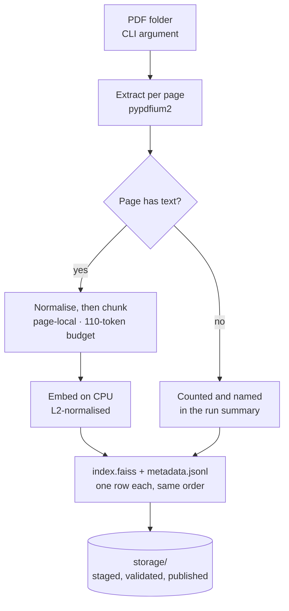
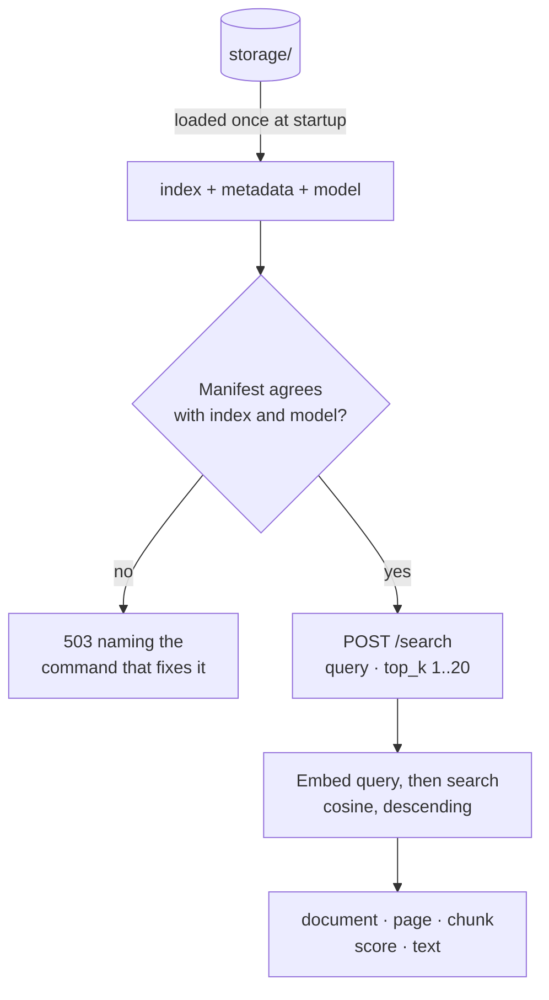
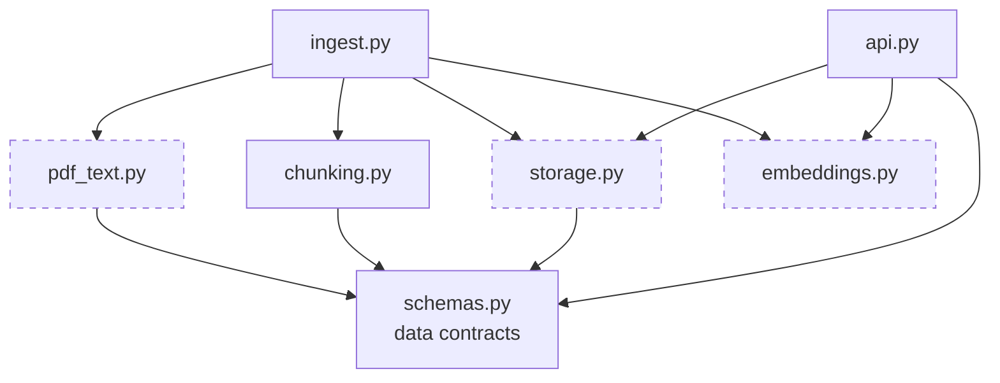

# PDF Search API

**Semantic search over a local corpus of French public-sector PDFs — every result traceable to its
document and page.**


Two parts: a command-line ingestion program that extracts, chunks, embeds and indexes the documents,
and a FastAPI service that answers similarity queries with exact provenance — document, page, chunk
and score.

Everything runs locally on CPU. No paid APIs, no managed services, no network access at query time.

---

## What this does, in plain terms

French communes are legally required to publish what they decide — _délibérations_, _procès-verbaux_,
_arrêtés_, meeting agendas. They publish them as PDFs, one commune at a time, in no common format.
The information is simultaneously public and unusable: to find the one paragraph that matters, somebody
has to open every file and read it.

This service removes the reading. Point the ingestion command at a folder of PDFs and it reads every
page once, building a local search index. After that, an analyst asks a question in ordinary French —
_"redevance de concession versée par GRDF"_ — and gets back the passages that answer it, ranked, each
one carrying **the file it came from, the page number, and a similarity score**.

The page number is the point. In public-affairs work a passage without its source is worthless: you
cannot cite it, act on it, or defend it in a meeting. So a passage is never allowed to straddle two
pages, which keeps the page number exact rather than estimated — open the PDF at that page and the
text is there. That constraint costs some retrieval quality, and the reasoning is set out in
[Design decisions](#design-decisions).

On the seven documents supplied with this exercise — 64 pages of council minutes, a sponsorship
contract, a roadworks order, an agenda and a signed table of resolutions — indexing takes about ten
seconds on a laptop CPU, and queries return in milliseconds. There is no LLM anywhere in this system:
it finds passages, it does not write answers, so it cannot invent one.

---

## Contents

- [Quick start](#quick-start) · [Running without Docker](#running-without-docker)
- [API](#api)
- [Architecture](#architecture)
- [The corpus](#the-corpus)
- [Design decisions](#design-decisions)
- [Solution Review](#solution-review) — assumptions, limitations, where it fails, what production needs
- [Project structure](#project-structure) · [Tests](#tests) · [Licence](#licence)

---

## Quick start

```bash
# 1. Build
docker build -t pdf-search-api .

# 2. Put the PDFs somewhere local
mkdir -p sample-pdfs && cp /path/to/*.pdf sample-pdfs/

# 3. Ingest — the PDF folder path is the command-line argument
docker run --rm \
  -v "$(pwd)/sample-pdfs:/input:ro" \
  -v "$(pwd)/storage:/storage" \
  pdf-search-api ingest --input-dir /input --output-dir /storage

# 4. Verify the index was created
ls storage/            # index.faiss  metadata.jsonl  manifest.json

# 5. Serve
docker run --rm -p 8000:8000 \
  -v "$(pwd)/storage:/storage:ro" \
  pdf-search-api api

# 5b. The API loads the model and index at startup. On a cold container that
#     takes tens of seconds -- wait for health to report ok before querying.
curl -s localhost:8000/health

# 6. Query
curl -s localhost:8000/search \
  -H 'Content-Type: application/json' \
  -d '{"query":"Quelle est la position du document sur les politiques publiques ?","top_k":5}'
```

<details>
<summary>PowerShell equivalents</summary>

```powershell
docker build -t pdf-search-api .

docker run --rm `
  -v "${PWD}/sample-pdfs:/input:ro" `
  -v "${PWD}/storage:/storage" `
  pdf-search-api ingest --input-dir /input --output-dir /storage

docker run --rm -p 8000:8000 `
  -v "${PWD}/storage:/storage:ro" `
  pdf-search-api api

Invoke-RestMethod -Uri http://localhost:8000/search -Method Post `
  -ContentType 'application/json' `
  -Body '{"query":"convention de mecenat","top_k":5}'
```

</details>

**Rebuilding after the PDF folder changes:** re-run step 3. Every run is a full rebuild; the new snapshot is
written to a staging directory, validated, and only then swapped into place. Stop the API first — ingestion
and serving are separate commands and the API holds the index open.

> **Windows note:** in Git Bash, MSYS rewrites container paths into Windows paths, so `/input` becomes
> something like `C:/Program Files/Git/input`. Ingestion then fails with `input directory does not exist`,
> and — less obviously — `docker run` for the API silently mounts the wrong directory, so `/health` reports
> `unavailable` even though `storage/` is populated. Prefix **every** `docker run` here with
> `MSYS_NO_PATHCONV=1`, or use PowerShell. This is a Git Bash quirk, not a container problem.

### Running without Docker

```bash
python -m venv .venv && . .venv/bin/activate     # Windows: .venv\Scripts\activate
pip install -r requirements-dev.txt
pip install torch --index-url https://download.pytorch.org/whl/cpu   # CPU-only, saves ~2.5 GB

PYTHONPATH=src python -m pdf_search.ingest --input-dir ./sample-pdfs --output-dir ./storage
PYTHONPATH=src uvicorn pdf_search.api:app --reload

PYTHONPATH=src pytest        # 62 tests, no network, no model download
```

---

## API

### `POST /search`

```json
{
  "query": "Quels sont les montants des subventions accordées aux associations ?",
  "top_k": 3
}
```

A real response from the corpus below, captured from the running service. `text` is reproduced in full
for the first hit and abridged for the others, which is the only edit made to it:

```json
{
  "query": "Quels sont les montants des subventions accordées aux associations ?",
  "results": [
    {
      "document_name": "d132664843659300_5271.pdf",
      "page_number": 11,
      "chunk_index": 134,
      "score": 0.7152196168899536,
      "text": "Région (autre fond) Département (plafonné à 25 000 €) 12 800 € 40% EPCI (fonds de concours) Autres Autofinancement 19 200 € 60% TOTAL H.T 32 000 € TOTAL H.T 32 000 € 100% APRÈS en avoir délibéré, à l'unanimité, Le Conseil municipal, APPROUVE le plan de financement prévisionnel, SOLLICITE une demande de subvention au titre de l'entretien de la voirie auprès du Président du"
    },
    {
      "document_name": "d132664843659300_5271.pdf",
      "page_number": 18,
      "chunk_index": 191,
      "score": 0.6899116039276123,
      "text": "Le même article précise dans son alinéa 2 que tous groupements, œuvres ou entreprises privées qui ont reçu dans l'année en cours une ou plusieurs subventions sont tenus de fournir …"
    },
    {
      "document_name": "d132664843659300_5271.pdf",
      "page_number": 19,
      "chunk_index": 194,
      "score": 0.6718683242797852,
      "text": "Associations extérieures :\nAssociations à caractère social :\nSubventions exceptionnelles :"
    }
  ]
}
```

`top_k` defaults to 5 and is bounded to 1–20. `score` is a **cosine similarity in [-1, 1] where higher is
more similar**, and results are sorted descending.

| Status | When                                                                                                                 |
| ------ | -------------------------------------------------------------------------------------------------------------------- |
| `422`  | Blank query, or `top_k` outside 1–20                                                                                 |
| `503`  | No index, or the index disagrees with its metadata or the loaded model — the message names the command that fixes it |

### `GET /health`

Reports whether an index is loaded and how many chunks it holds. Degrades to `status: "unavailable"` with a
diagnostic rather than erroring, so a container started without an index is still inspectable.

The container's `HEALTHCHECK` requires `status: "ok"`, not merely HTTP 200 — an API that loaded but has no
index can answer nothing, and should not be advertised as ready to an orchestrator.

---

## Architecture

Ingestion and serving are **separate commands** that share nothing but a directory on disk. Ingestion
writes a snapshot; the API reads one. Neither imports the other. That is what makes a rebuild safe
without an atomic directory swap — see [Full rebuild, no incremental path](#full-rebuild-no-incremental-path).

### Ingestion — run once per corpus change



A page that yields no text is **reported, not skipped**. A pipeline that quietly indexes nothing looks
identical to one that succeeded, and that is the failure mode worth engineering against.

### Query — the API loads once at startup



A failed load is **recorded, not raised**: the container starts and explains itself on `/health`
rather than crash-looping, which is far easier to diagnose.

### Modules and seams



`schemas.py` is the leaf — everything depends on it and it depends on nothing, which is why the
on-disk record format and the HTTP wire format cannot drift apart. Nothing imports `ingest.py` or
`api.py`.

The three dashed modules are the **deliberate seams**, placed only where a second implementation is
genuinely plausible: an OCR extractor behind `pdf_text`, a fake embedder behind `embeddings` (which
is what lets the whole test suite run with no model download), and sqlite-vec or Elasticsearch behind
`storage`. `chunking.py` and `ingest.py` have no seam, because inventing an interface with exactly
one implementation is cost without benefit.

| Module          | Role                                                  |
| --------------- | ----------------------------------------------------- |
| `schemas.py`    | Pydantic contracts shared by disk format and HTTP API |
| `pdf_text.py`   | Per-page extraction and French text normalisation     |
| `chunking.py`   | Page-local, token-budgeted splitting                  |
| `embeddings.py` | `Embedder` protocol + sentence-transformers adapter   |
| `storage.py`    | FAISS index, JSONL metadata sidecar, manifest, search |
| `ingest.py`     | CLI orchestration                                     |
| `api.py`        | FastAPI app, loads the index once at startup          |

---

## The corpus

The seven PDFs supplied with the exercise are not in this repository — they belong to Datapolitics and
are not mine to publish. They are described here because the design decisions below were made against
these specific documents, not against a hypothetical corpus.

| Document                                 | Share                           | What it is                                             | What it breaks                                                                                |
| ---------------------------------------- | ------------------------------- | ------------------------------------------------------ | --------------------------------------------------------------------------------------------- |
| `d132664843659300_5271.pdf`              | **81.5 %** · 311 chunks · 47 pp | Municipal council minutes, Pluméliau-Bieuzy (Morbihan) | Dominates the corpus. Almost any topical query ranks it first on sheer mass                   |
| `159687_…convention_de_mecenat…pdf`      | 8.8 % · 36 chunks · 7 pp        | Draft sponsorship contract, Béziers                    | Continuous legal prose — the easy case                                                        |
| `d235546020071500_9622.pdf`              | 3.1 % · 12 chunks · 2 pp        | Roadworks order, Jouy-en-Josas                         | Dense with identifiers (`ARR2026-222`, GPS coordinates) that dense retrieval handles poorly   |
| `Ordre_du_jour_18-06-2026.pdf`           | 2.4 % · 9 chunks · 2 pp         | Council agenda, Grand Annecy                           | Short list items carry little context; mean pooling pushes them toward the corpus average     |
| `AW Solutions – Dématérialisation…pdf`   | 2.2 % · 9 chunks · 2 pp         | Public tender notice / sales deck                      | Multi-column, and off-topic relative to the rest — a topical query can surface it             |
| `260520_TABLEAU_DELIBERATIONS_SIGNE.pdf` | 2.1 % · 10 chunks · 2 pp        | Signed table of resolutions, Pluherlin                 | Linearised table: the header row that gives every other row its meaning ends up far from them |
| `AFF-2026.06.11-DP-…ACCORD.pdf`          | **0 %** · 0 chunks · 2 pp       | Stamped planning permission notice                     | **No text layer at all.** Scanned image. Ingested, counted, named — and contributes nothing   |

So of seven documents ingested, **six are retrievable**. The seventh is the OCR case, and the
ingestion summary names it explicitly rather than reporting a clean run over a document it silently
dropped.

Two properties of this corpus shape everything below: one document is four fifths of the text, and the
documents are heterogeneous in genre — official records beside a vendor brochure. Both are realistic,
and both hurt dense retrieval in ways described in
[Where search quality will be poor](#where-search-quality-will-be-poor).

---

## Design decisions

### Chunks are sized in tokens, not characters — this is the important one

`paraphrase-multilingual-MiniLM-L12-v2` sets `max_seq_length` to **128 tokens** in its
`sentence_bert_config.json`, and sentence-transformers **truncates anything longer silently** — no warning,
no exception. Its `tokenizer_config.json` separately reports `model_max_length: 512`, which is misleading;
sentence-transformers uses the 128.

I measured this model's tokenizer on French administrative prose (délibération and urbanisme phrasing) and
got **3.93 characters per token**. So the common 1000-character chunk default is about **254 tokens —
roughly twice the model's window**. Half of every such chunk would be discarded before pooling, _while the
API still returned the full text to the caller_. The vector would describe the head of the passage; the
response would show all of it. Nothing errors, and the symptom looks like a chunking problem.

That ratio depends on text density -- sparse, heavily-formatted pages tokenise more cheaply than continuous
prose -- so the budget is enforced by measuring each chunk with the real tokenizer rather than by assuming a
character count.

So the budget is **110 tokens of content** (≈432 characters of French here), measured with the model's own
tokenizer. Chunks are assembled at natural boundaries — paragraph, line, sentence, then whitespace — with a
~20-token overlap carried as whole trailing sentences.

The budget is enforced as a **post-condition**: every chunk is re-measured before it becomes a record, and
the overlap is carried _within_ the budget rather than added on top of it. That distinction is the whole
game — adding the carry on top is the easy mistake, and it silently reintroduces exactly the truncation this
section exists to prevent. 128 minus the two special tokens leaves **126** tokens of real capacity, so the
110-token budget is deliberate headroom rather than slack to spend.

Nothing is discarded along the way. What is conserved is the text between separators rather than the bytes:
the splitter consumes the separator it splits on and the merge rejoins on a single space, so runs of
whitespace are normalised. The tests assert word-level conservation for that reason, rather than claiming
more than holds.

I did not raise `max_seq_length` to 256. It is mechanically possible, since the backbone has 512 positions,
but the model was distilled and trained at 128, so longer inputs are out of distribution. That is worth an
A/B against a labelled set, not a silent change.

### Chunks never span a page boundary

`page_number` is therefore exact rather than reconstructed from character offsets, and every result is
directly auditable — open the PDF at that page and the passage is there. The cost is real: a sentence
straddling a page break gets cut, and a paragraph continued across pages becomes two chunks that each see
half the context. For a corpus whose unit of meaning is usually a numbered article, an agenda item or a table
row, that trade is worth it. For flowing narrative prose it would not be.

### The score is an honest cosine

Vectors are L2-normalised at encode time and the index is `IndexFlatIP`, so the inner product **is** the
cosine similarity: bounded, higher-is-better, no transform to explain.

The alternative, `IndexFlatL2`, returns a _squared_ Euclidean distance where **lower** is better. Returning
that in a field named `score` inverts the ordering for any client that sorts descending. Note also that
`normalize_embeddings` defaults to `False`; leaving it off turns retrieval into length-biased inner-product
search, where long chunks win on magnitude alone. Normalisation happens in exactly one place, in
`SentenceTransformerEmbedder.encode`.

### PDF extraction: pypdfium2

I selected pypdfium2 to avoid an AGPL/commercial dependency in a proprietary-service context. pypdfium2 is
Apache-2.0/BSD-3; note that its exact licence set depends on the packaged PDFium build. PyMuPDF is the
stronger extractor and would be my choice under a commercial licence.

### FAISS, though numpy would do

At this corpus size the index is a few hundred chunks — well under a megabyte of vectors. A flat FAISS index
is a SIMD wrapper around a dot product and has no algorithmic advantage here; `embeddings @ query` would be
equivalent. I kept FAISS for its persistence API and because it is the migration path to HNSW without
changing the storage interface, not because it is faster. I would move off flat at roughly 10⁶ vectors, or
earlier if p99 latency or concurrent QPS mattered — flat search cost is linear per query.

### Full rebuild, no incremental path

Every ingestion run rebuilds from scratch. At this scale a rebuild costs seconds, and it removes the whole
class of drift bugs a partial re-ingest path creates. The snapshot is written to a staging directory,
reloaded and validated, then swapped in. This is deliberately **not** described as an atomic directory swap —
a portable one does not exist — which is why ingestion and serving are separate commands.

### Consistency is asserted, not assumed

FAISS stores only vectors and row ids, so chunk metadata lives in a JSONL sidecar whose line order _is_ the
index row order. Row count and dimension agreeing proves only that the shapes match — two unrelated
snapshots of the same corpus size agree on both — so the manifest records a **sha256 of the index and of the
sidecar**, computed over the staged bytes before publication and verified on every load. Sidecar line order
is checked against index row position, and the metric is confirmed to be inner product so the scores really
are the cosine similarities this API promises. Any mismatch raises rather than returning confident, wrong
provenance, and the API turns it into a 503 that names the command to fix it.

The manifest also records the model, dimension, metric and normalisation, and it is the manifest — not the
environment — that decides which model may serve the index. An override naming a different model is refused
at startup rather than honoured, because two models can share an embedding width: the dimension check would
pass while every query vector landed in a different space from the documents, and every score would look
plausible.

### No LangChain

`langchain-text-splitters` pulls `langchain-core` and around ten transitive dependencies to obtain what is an
80-line string splitter. Its FAISS wrapper also returns raw L2 distance as `score` by default, which is the
bug described above. The splitter here is about 60 lines and I can explain all of them.

### De-hyphenation is deliberately naive, and it costs something

Words broken across a line break are rejoined, because a split token corrupts the embedding. The rule is a
single regex, and it cannot tell a line wrap from a genuine compound: 'adminis-/tration' is correctly joined,
and 'sous-/prefet' wrapped at its own hyphen is incorrectly joined too. Separating them needs a lexicon.
The behaviour is pinned by a test that documents it as a known false positive rather than hiding it.

### File ordering is explicitly case-folded

Sorting `Path` objects directly is not portable — the comparison is case-insensitive on Windows and
case-sensitive on Linux, so the same corpus would produce different chunk indices on a developer machine and
inside this image. A test caught it.

---

## Solution Review

### Tested on the supplied corpus

Run on the seven PDFs provided with the exercise:

| Documents | Pages | Pages with text | Pages with no text | Chunks | Characters | Ingestion |
| --------- | ----- | --------------- | ------------------ | ------ | ---------- | --------- |
| 7         | 64    | 62              | 2                  | 387    | 136,580    | 8.7 s     |

These figures come from the local run (`python -m pdf_search.ingest`). The Docker path invokes the same
entry point over the same corpus, so it produces the same index — ingestion is deterministic and nothing in
it depends on the container.

Observations from that run, all matching the limitations described below:

- **Both no-text pages belong to one document** — the stamped urbanisme _déclaration préalable_, which has no
  text layer at all, so **six of the seven documents are actually retrievable** (see
  [The corpus](#the-corpus)). Ingestion names it and warns that it contributed nothing to the index, rather
  than reporting a clean run over a document it silently dropped. It is the OCR case, and it is why OCR
  routing is the second item on the improvements list.
- **No chunk was truncated.** Measured against the model's own tokenizer, the longest chunk is 112 tokens
  including the two special tokens, against a 128-token encoder window — so every indexed vector represents
  the whole of the text returned to the caller. That is the property the token-based sizing exists to
  guarantee, and on this corpus it holds for all 387 chunks.

Page provenance was checked rather than assumed: every one of the 387 chunks was matched back to the page it
claims, by re-extracting each source PDF and confirming the chunk text occurs on that page. 387 of 387.

- **One passage was being silently dropped, and now is not.** Chunks below a minimum length used to be
  discarded whenever a page produced more than one. On this corpus that cost exactly one chunk —
  `"Jean-Pierre GALUDEC"`, a signatory on page 2 of the signed table of resolutions. A name is short, not
  unimportant, and for a tool whose product is provenance, a passage the corpus contains but the index does
  not is the wrong kind of bug to leave in. Runts are now folded into the preceding chunk where the budget
  allows and kept standalone otherwise. The corpus went from 386 chunks to 387; nothing that was indexed
  before was lost.

### Assumptions

- Documents are **text-native**. There is no OCR, so a scanned page contributes nothing.
- Documents are predominantly **French**; the model is multilingual but chunk sizing was measured on French.
- The corpus is small enough that a **full rebuild** is the right update strategy.
- The **same model** embeds documents and queries. The manifest records it and startup refuses a model
  that disagrees, so this is enforced rather than assumed.
- Page numbers are those reported by the extractor, **1-based**, matching what a reader sees.
- A single writer and a single reader; there is no concurrent index lifecycle.

### Main limitations

- **No OCR.** Pages with no text layer are indexed as nothing. They are counted and named in the ingestion
  summary rather than silently skipped, because a document contributing zero chunks must not look like a
  successful run.
- **Multi-column reading order is not reconstructed.** This is a known limitation of every permissively
  licensed extractor, not of the chunker — a slide deck or a two-column layout arrives already interleaved,
  and no chunking strategy repairs that downstream.
- **Tables are linearised.** Row and column association is lost, so a table row's meaning — which lives in a
  header cell — ends up far away in the text stream.
- **Headers and footers are not stripped.** This is deliberate; see below.
- **Full rebuild only** — no incremental update, no deletion tracking, no versioned snapshots.
- **Single node, in-memory index**, loaded once at startup.
- The image bakes the model at **build** time, so `docker build` needs network access; runtime does not.

### Where search quality will be poor

- **Exact identifiers and proper nouns.** Dense retrieval is weakest precisely where this corpus is
  distinctive: surnames, commune names, acronyms, and legal citations of the `L. 2121-29` form. A lexical
  (BM25) lane wins on rare tokens. This is the first thing I would add — see below.

  This is not hypothetical, so here it is measured. Querying `convention de mécénat financier` — the exact
  title of a document in the corpus — returns that document **third**:

  1. **0.624** — `Ordre_du_jour_18-06-2026.pdf` p.1, _"Compte financier unique 2025 du budget annexe …"_
  2. **0.554** — `d132664843659300_5271.pdf` p.6, a budget table of credits and subsidies
  3. **0.533** — `159687_…convention_de_mecenat…pdf` p.1, **_"CONVENTION DE MÉCÉNAT FINANCIER …"_**

  Two passages that merely share the register of municipal finance outrank an exact title match. Mean-pooled
  multilingual embeddings encode topic, not tokens, and "mécénat" carries little weight against the general
  financial vocabulary surrounding it. A BM25 lane fused with this one would put the titled document first
  on term rarity alone. That is the argument for hybrid retrieval, and it is one example rather than a
  benchmark — see [What I would improve with more time](#what-i-would-improve-with-more-time).

- **Scanned documents.** Nothing to retrieve.
- **Tabular documents.** A chunk from a linearised table is often meaningless in isolation.
- **Heterogeneous corpora.** If the corpus mixes genres — say, official records and a vendor brochure — a
  topical query can surface the commercially-worded document, because there is no document-level filtering or
  type awareness. At this scale there should not be, but it is a real quality effect.
- **Very short pages.** An agenda line carries little context, and mean pooling over a short chunk produces a
  vector close to the corpus average.
- **Long-range questions.** Anything requiring evidence combined across pages or documents; this returns
  passages, it does not synthesise.

### Why I did not strip headers and footers

The standard heuristic is frequency plus position — lines recurring in the top or bottom zone of most pages.
I tried to justify it and concluded it would do more harm than good on a corpus like this one, for reasons
specific to these documents:

1. **It deletes table headers.** In a table of deliberations the column-header row repeats on every page —
   and it is the row that gives every other row its meaning.
2. **It eats short documents.** On a two-page agenda, "appears on both pages" clears any percentage
   threshold, so the rule starts deleting body text.
3. **The naive version does not even fire.** The most common French footer is `Page 3 sur 12`, which never
   repeats verbatim; digits have to be masked before counting or the heuristic silently does nothing.

Making it safe means digit masking, an absolute page-count gate, and table-region exclusion. That is real
work against an explicit instruction not to over-invest in cleaning, so the analysis is here and the code is
not.

There is a related opportunity I would take with more time. French délibérations carry an ACTES
télétransmission stamp — _"Accusé de réception en préfecture"_ — with the commune, the acte identifier and
the préfecture receipt date. Judged by frequency that is boilerplate. Judged by usefulness it is some of the
most valuable structured metadata in the document. The right handling is **extract, then strip**: lift it
once into document-level metadata and remove it from the chunk text. Deleting it outright would be a product
bug, not just a text bug.

### What I would improve with more time

1. **A hybrid lexical + dense retriever.** BM25 over the same chunks, fused with the dense ranking. This is
   the single largest quality win available for a corpus full of names and legal references.
2. **OCR routing** for pages detected as having no text layer.
3. **Table-aware extraction** — detect table regions and emit one chunk per row, carrying the header.
4. **A labelled evaluation set.** Hand-labelled query→document pairs, reported as recall@k with the sample
   size stated, so chunking and normalisation changes can be measured instead of argued. I would not report a
   quality number from a set I wrote and graded myself without saying exactly that.
5. **ACTES stamp extraction** into document-level metadata, then filterable.
6. **Measured `max_seq_length` A/B** at 128 vs 256 against that labelled set.

### A production version

- **PostgreSQL** as the metadata store of record instead of a JSONL sidecar — the index/metadata alignment
  becomes a foreign key rather than a convention, and chunks become queryable by document, date and type.
- **Elasticsearch** for the lexical and filter layer, with a French analyzer (elision, stemming, ASCII
  folding). Vectors either alongside it in a `dense_vector` field — one query engine rather than two, at some
  cost in ANN flexibility — or in a dedicated store, depending on how much filtering matters relative to
  recall tuning.
- **Filtered search is the part that actually forces the architecture.** A query like _"only deliberations
  from this département, in 2026, excluding tenders"_ cannot be served by post-filtering a flat vector index:
  the top-k may be entirely filtered away, so the result set silently shrinks or empties. Pre-filtering is
  what an inverted index gives you and a flat vector index does not.
- **Object storage** for raw PDFs, content-addressed, so extraction is always replayable.
- **Immutable, versioned index snapshots** with an atomic pointer swap, so the serving tier never reads a
  half-written build. Ingestion as a scheduled job, the API as a separate long-running deployment.
- **Observability on the numbers that matter**: pages yielding no text per source, chunk-count deltas between
  runs, and a freshness target per source — alerting on **absence** of expected content, not only on errors.
  A pipeline that quietly indexes nothing is the failure mode that looks like success.
- **Redis** for query-embedding and hot-result caching.
- Authentication, rate limiting, and per-tenant corpus isolation, none of which are in scope here.

### Explicitly out of scope

No LLM or answer generation, no UI, no authentication, no database, no OCR, no reranker, no job queue, no
hybrid retrieval. And no claim that one small multilingual model is production-grade for French
public-sector documents — it is a reasonable CPU-runnable baseline, chosen because the exercise asked for
one.

---

## Project structure

```
pdf-search-api/
├── src/pdf_search/
│   ├── schemas.py       # Pydantic contracts — the leaf of the dependency graph
│   ├── pdf_text.py      # pypdfium2 extraction + French normalisation
│   ├── chunking.py      # page-local, token-budgeted splitting
│   ├── embeddings.py    # Embedder protocol + sentence-transformers adapter
│   ├── storage.py       # FAISS index, JSONL sidecar, manifest, search
│   ├── ingest.py        # CLI entry point (pdf-search-ingest)
│   └── api.py           # FastAPI app
├── tests/
│   ├── conftest.py      # FakeEmbedder + injected token counter — no model download
│   └── fixtures/        # two synthetic PDFs, with the script that regenerates them
├── Dockerfile           # single stage, CPU-only torch, model baked at build time
├── docker-entrypoint.sh # ingest | api | anything else
└── storage/             # generated: index.faiss · metadata.jsonl · manifest.json
```

`sample-pdfs/` and `storage/` are git-ignored. The PDFs were provided by Datapolitics and are not
mine to publish; the index is a build artefact.

---

## Tests

```bash
PYTHONPATH=src pytest
```

62 tests, running in under three seconds with **no network access and no model download** — the embedder and
the token counter are both injected, and the API fixtures replace the startup builder before the application
starts rather than after, so no test touches a real model or a real index directory. They cover the token
budget including the overlap case that used to breach it, word-level text conservation, page attribution,
chunk-index stability, the French text normalisation cases, score orientation and range, the
`top_k`-larger-than-corpus path, the snapshot binding guards (reordered sidecar, swapped index, missing
digest), the refusal of a model that disagrees with the manifest, and the API contract and failure modes.

The real tokenizer is exercised once, manually, during an ingestion smoke run — deliberately, so the suite
stays fast and offline.

---

## Licence

[MIT](LICENSE). Note that the runtime dependencies were chosen to keep the whole stack permissively
licensed — see [PDF extraction: pypdfium2](#pdf-extraction-pypdfium2), where that constraint decided
the extractor.

The seven source PDFs are **not** covered by this licence and are not included in this repository.

## Author

Pyae Sone Kyaw (Seon) — [github.com/soneeee22000](https://github.com/soneeee22000)
